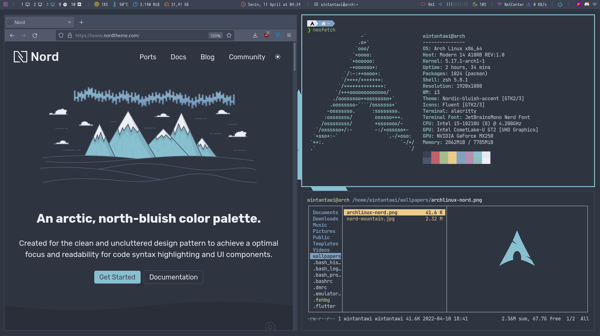

# Workspace

- **Operating System**: Arch Linux
- **Window Manager**: i3-gaps (i3 window manager)
- **Desktop Manager**: LightDM
- **Theme**: Nord
- **Fonts**: JetBrainsMono Nerd Font

## Applications
- **Terminal**: Alacritty
- **Shell**: Zsh + Oh-My-Zsh + PowerLevel10k
- **AUR Helper**: Yay
- **Boot manager**: rEFInd
- **SDK Manager**: SDKMan
- **Backup**: Timeshift
- **Bar**: Polybar
- **Background**: Feh
- **Compositor**: Picom
- **Brightness**: brightnessctl
- **Notification**: Dunst
- **Authentication Agent**: lxpolkit
- **File Manager**: Thunar, Ranger
- **Text Editor/IDE**: Leafpad, VIM
- **PDF/Ebook Viewer**: Foliate
- **Image Viewer**: Geeqie
- **Video player**: VLC
- **Email Client**: Thunderbird
- **Browser**: Librewolf, Firefox, Chromium, Google Chrome
- **Screenshot**: Flameshot
- **Screen Recording**: OBS Studio
- **Virtual Machine**: VirtualBox
- **Calculator**: Galculator
- **Others**: ...

## Screenshots

